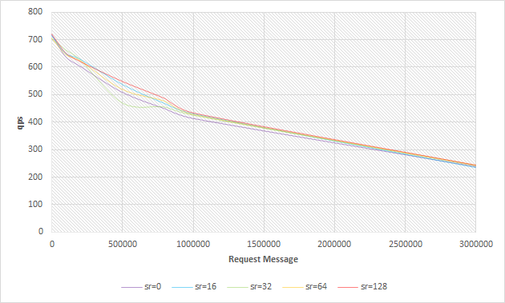

# Benchmark for Grpc Write/Read Size

Envirment:

> OS: linux
>
> Memery：8G
>
> CPU: 4-cores

Benchmark File:

> grpc/benchmark/run_bench.sh

Args Table:

> number of concurrent RPC calls ( r )  for each Connection 
> number of Connections ( c )
> server write buffer size ( sw )
> server read buffer size ( sr )
> client ReadBuffer  ( cr )
> client WriteBuffer  ( cw )
> req size in bytes ( req )
> resp size in bytes ( resp )

## 1. Relationship between r and sw/sr

**Const Args:**

`c = 1, cr/cw = 128k, req = 1M, resp = 1M`

**Const Args:**

`c = 10, cr/cw = 128k, req = 1M, resp = 1M`

### Relationship between r and sw

**Const Args:**

`c = 1, cr/cw = 128k, req = 1M, resp = 1M, sr = 0`

### Relationship between r and sr

**Const Args:**

`c = 10, cr/cw = 128k, req = 1M, resp = 1M, sw = 0`

**Conclusion:**

1. In general, the increase in buffer size is conducive to improve the concurrency of the program, slightly improve the qps of the server. When the number of concurrent calls increases, the qps gain from increasing the buffer will be more obvious.
2. The gain from increasing the WriteBuffer size will be more stable than the gain from ReadBuffer.

## 2. Relationship between c and sw/sr

**Const Args:**

`r = 1, cr/cw = 128k, req = 1M, resp = 1M`

###Relationship between c and sw

**Const Args:**

`r = 1, cr/cw = 128k, req = 1M, resp = 1M, sr = 10`

### Relationship between c and sr

**Const Args:**

`r = 1, cr/cw = 128k, req = 1M, resp = 1M, sw = 10`

**Conclusion:**

1. When the number of connections is large but there are few concurrent calls, the size of the **Read Buffer has almost no effect** on qps. 

## 3. Relationship between MessageSize(req/resp) and sr/sw

### Relationship between req and sr

**Const Args:**

`c = 800, r=1, cr/cw=128k sw=0, resp=1M` 

### Relationship between resp and sw

**Const Args:**

`c = 800, r=1, cr/cw=128k, sr=0, req=1M`

​                   

## 4. For The User of ISTIO

1. When you want to reduce the memory footprint of the pilot, first reduce the ReadBufferSize, which has less impact on the qps of the pilot.
2. When you want to increase the processing speed of the pilot by increasing the grpc buffer size,  you should increase the writeBufferSize first.
3. If  the number of xds connections is `n`, the change value of writeBufferSize is `Δw`, and the change value of readBufferSize is `Δr`, then your final memory changes is:  $$n(2Δw+Δr)$$